<picture>
  <source media="(prefers-color-scheme: dark)" srcset="./assets/hero.png">
  <source media="(prefers-color-scheme: light)" srcset="./assets/light/hero_light.png">
  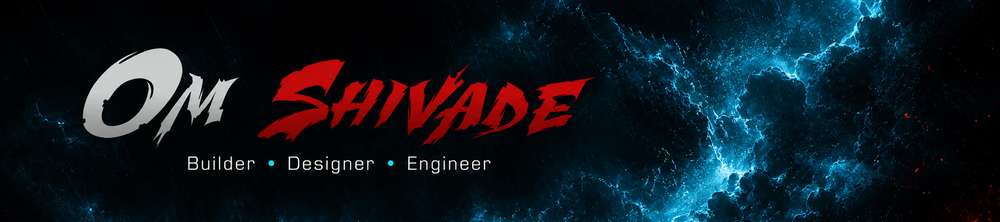
</picture>

<picture>
  <source media="(prefers-color-scheme: dark)" srcset="./assets/cards/main_quests_header.png">
  <source media="(prefers-color-scheme: light)" srcset="./assets/light/cards/main_quests_header_light.png">
  
</picture>

<a href="https://github.com/omvs077/ByteLock"><picture>
  <source media="(prefers-color-scheme: dark)" srcset="./assets/cards/card_bytelock.png">
  <source media="(prefers-color-scheme: light)" srcset="./assets/light/cards/card_bytelock_light.png">
  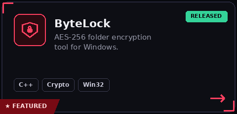
</picture></a>
<a href="https://github.com/omvs077/FileFlattener"><picture>
  <source media="(prefers-color-scheme: dark)" srcset="./assets/cards/card_fileflattener.png">
  <source media="(prefers-color-scheme: light)" srcset="./assets/light/cards/card_fileflattener_light.png">
  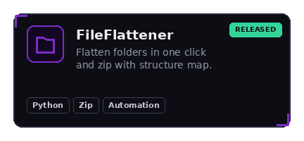
</picture></a>
<a href="https://github.com/omvs077/speeddial-board-browser-extension"><picture>
  <source media="(prefers-color-scheme: dark)" srcset="./assets/cards/card_speeddial_board.png">
  <source media="(prefers-color-scheme: light)" srcset="./assets/light/cards/card_speeddial_board_light.png">
  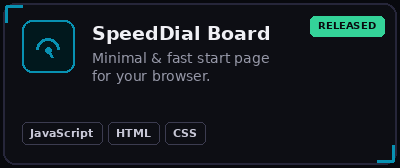
</picture></a>
 
<a href="https://github.com/omvs077/ClipManager"><picture>
  <source media="(prefers-color-scheme: dark)" srcset="./assets/cards/card_clipmanager.png">
  <source media="(prefers-color-scheme: light)" srcset="./assets/light/cards/card_clipmanager_light.png">
  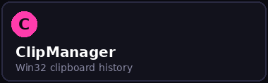
</picture></a>
<a href="https://github.com/omvs077/TaskBuddy-taskmanager"><picture>
  <source media="(prefers-color-scheme: dark)" srcset="./assets/cards/card_taskbuddy.png">
  <source media="(prefers-color-scheme: light)" srcset="./assets/light/cards/card_taskbuddy_light.png">
  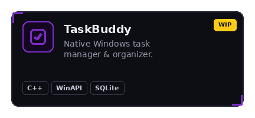
</picture></a>
<a href="https://github.com/omvs077/GeruBlocks"><picture>
  <source media="(prefers-color-scheme: dark)" srcset="./assets/cards/card_gerublocks.png">
  <source media="(prefers-color-scheme: light)" srcset="./assets/light/cards/card_gerublocks_light.png">
  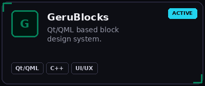
</picture></a>
 
<a href="https://github.com/omvs077/svaar-music"><picture>
  <source media="(prefers-color-scheme: dark)" srcset="./assets/cards/card_svaar-music.png">
  <source media="(prefers-color-scheme: light)" srcset="./assets/light/cards/card_svaar-music_light.png">
  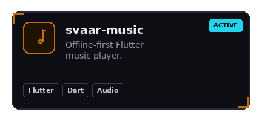
</picture></a>
<a href="https://github.com/omvs077/ai-chat-to-word-and-pdf"><picture>
  <source media="(prefers-color-scheme: dark)" srcset="./assets/cards/card_ai-chat-to-word-and-pdf.png">
  <source media="(prefers-color-scheme: light)" srcset="./assets/light/cards/card_ai-chat-to-word-and-pdf_light.png">
  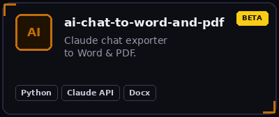
</picture></a>
<a href="https://github.com/omvs077/climagrid"><picture>
  <source media="(prefers-color-scheme: dark)" srcset="./assets/cards/card_climagrid.png">
  <source media="(prefers-color-scheme: light)" srcset="./assets/light/cards/card_climagrid_light.png">
  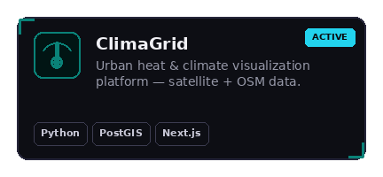
</picture></a>

<picture>
  <source media="(prefers-color-scheme: dark)" srcset="./assets/cards/loadout_header.png">
  <source media="(prefers-color-scheme: light)" srcset="./assets/light/cards/loadout_header_light.png">
  
</picture>

<picture>
  <source media="(prefers-color-scheme: dark)" srcset="./assets/cards/loadout_languages.png">
  <source media="(prefers-color-scheme: light)" srcset="./assets/light/cards/loadout_languages_light.png">
  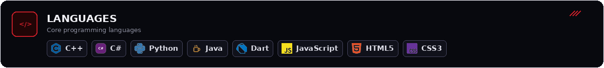
</picture>
<picture>
  <source media="(prefers-color-scheme: dark)" srcset="./assets/cards/loadout_frameworks.png">
  <source media="(prefers-color-scheme: light)" srcset="./assets/light/cards/loadout_frameworks_light.png">
  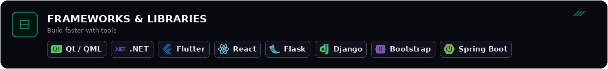
</picture>
<picture>
  <source media="(prefers-color-scheme: dark)" srcset="./assets/cards/loadout_databases.png">
  <source media="(prefers-color-scheme: light)" srcset="./assets/light/cards/loadout_databases_light.png">
  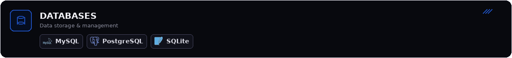
</picture>
<picture>
  <source media="(prefers-color-scheme: dark)" srcset="./assets/cards/loadout_tools.png">
  <source media="(prefers-color-scheme: light)" srcset="./assets/light/cards/loadout_tools_light.png">
  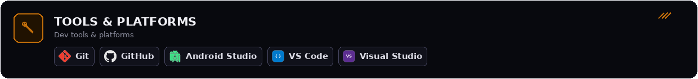
</picture>

<picture>
  <source media="(prefers-color-scheme: dark)" srcset="./assets/cards/footer.png">
  <source media="(prefers-color-scheme: light)" srcset="./assets/light/cards/footer_light.png">
  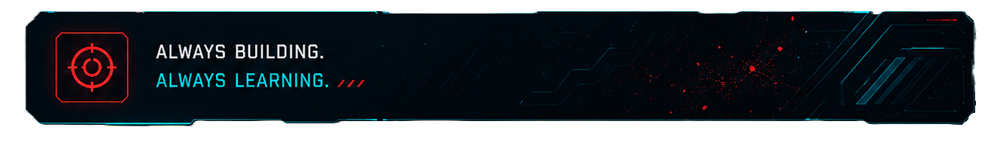
</picture>
